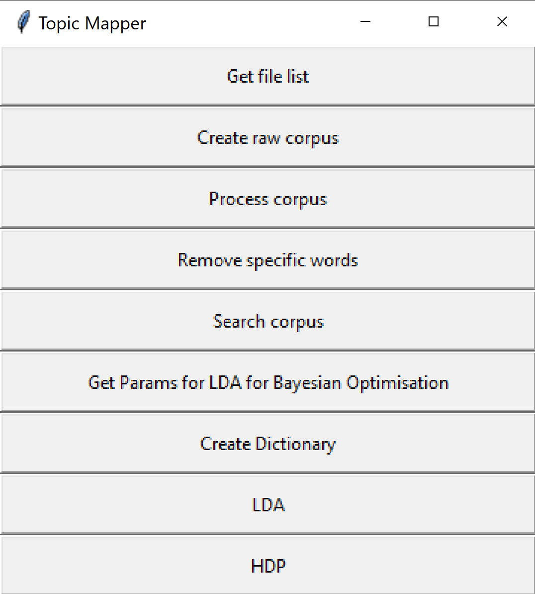

# projectMapper_v1
 
This is a repository for a GUI based applications for topic modelling and text search for research project dissertations.  This is work developed by Eduardo Viegas and Samuel Evans at KCL.   This designed to make topic modelling accessible to others.  The purpose of the application is to make it easy to analyse a large corpus of student research disserations to extract themes and to search for key terms.

The GUI interface is written in Tkinter and allows a range of searching and topic modelling approaches that include Latent Dirichlet Allocation using a Bayesian Optimisation search and Hierchical Dirichlet Process.

  

